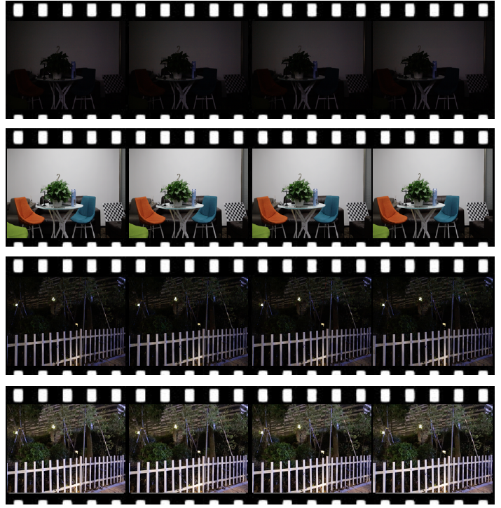

# Seeing Dynamic Scene in the Dark: High-Quality Video Dataset with Mechatronic Alignment

This is a pytorch project for the paper **Seeing Dynamic Scene in the Dark: High-Quality Video Dataset with Mechatronic Alignment** by Ruixing Wang, Xiaogang Xu, Chi-Wing Fu, Jiangbo Lu, Bei Yu and Jiaya Jia presented at **ICCV2021**.


## Introduction

It is important to enhance low-light videos where previous work is mostly trained on paired static images or paired videos of static scene. We instead propose a new dataset formed by our new strategies that contains high-quality spatially-aligned video pairs from dynamic scenes in low- and normal-light conditions.
It is by building a mechatronic system to precisely control dynamics during the video capture process, and further align the video pairs, both spatially and temporally, by identifying the system's uniform motion stage.
Besides the dataset, we also propose an end-to-end framework, in which we design a self-supervised strategy to reduce noise, while enhancing illumination based on the Retinex theory.




[paper link](https://jiaya.me/publication/)

## SDSD dataset

The SDSD dataset is collected as dynamic video pairs containing low-light and normal-light videos. This dataset is consists of two parts, i.e., the indoor subset and the outdoor subset.
There are 70 video pairs in the indoor subset, and there are 80 video pairs in the outdoor subset.

All data is hosted on [baidu pan](https://pan.baidu.com/s/1CSNP_mAJQy1ZcHf5kXSrFQ) (验证码: zcrb):  
indoor_np: the data in the indoor subset utilized for training, all video frames are saved as .npy file and the resolution is 512 x 960 for fast training.  
outdoor_np: the data in the outdoor subset utilized for training, all video frames are saved as .npy file and the resolution is 512 x 960 for fast training.  
indoor_png: the original video data in the indoor subset. All frames are saved as .png file and the resolution is 1080 x 1920.  
outdoor_png: the original video data in the outdoor subset. All frames are saved as .png file and the resolution is 1080 x 1920.  

The evaluation setting could follow the following descriptions:
1) randomly select 12 scenes from indoor subset and take others as the training data. The performance on indoor scene is computed on the first 30 frames in each of this 12 scenes, i.e., 360 frames.
2) randomly select 13 scenes from outdoor subset and take others as the training data. The performance on indoor scene is computed on the first 30 frames in each of this 13 scenes, i.e., 390 frames.
(the split of training and testing is pointed out by "testing_dir" in the corresponding config file)


The arrangement of the dataset is  
-indoor/outdoor  
 -GT # the videos under normal light  
  -pair1  
  -pair2  
  ...  
 -LQ # the videos under low light  
  -pair1  
  -pair2  
  ...  


After download the dataset, place them in './dataset' (you can also place the dataset in other place, once you modify "path_to_dataset" in the corresponding config file).


## The smid dataset for training

Different from the original setting of SMID, our work aims to enhance sRGB videos rather than RAW videos. Thus, we first transfer the RAW data to sRGB data with rawpy.
You can download the processed dataset for experiments using the following link: [baidu pan](https://pan.baidu.com/s/1Qol_4GsIjGDR8UT9IRZbBQ) (验证码: btux):

The arrangement of the dataset is  
-smid  
 -SMID_Long_np # the frame under normal light  
  -0001  
  -0002  
  ...  
 -SMID_LQ_np # the frame under low light  
  -0001  
  -0002  
  ...  

After download the dataset, place them in './dataset'. The arrangement of the dataset is the same as that of SDSD.
You can also place the dataset in other place, once you modify "path_to_dataset" in the corresponding config file.

## Project Setup

First install Python 3. We advise you to install Python 3 and PyTorch with Anaconda:

```
conda create --name py36 python=3.6
source activate py36
```

Clone the repo and install the complementary requirements:
```
cd $HOME
git clone --recursive git@github.com:dvlab-research/SDSD.git
cd SDSD
pip install -r requirements.txt
```

And compile the library of DCN:
```
python setup.py build
python setup.py develop
python setup.py install
```

## Usage

### Train

The training on indoor subset of SDSD:
```
python -m torch.distributed.launch --nproc_per_node 1 --master_port 4320 train.py -opt options/train/train_in_sdsd.yml --launcher pytorch
```

The training on outdoor subset of SDSD:
```
python -m torch.distributed.launch --nproc_per_node 1 --master_port 4320 train.py -opt options/train/train_out_sdsd.yml --launcher pytorch

```

The training on SMID:
```
python -m torch.distributed.launch --nproc_per_node 1 --master_port 4322 train.py -opt options/train/train_smid.yml --launcher pytorch
```

### Quantitative Test

We use PSNR and SSIM as the metrics for evaluation.

For the evaluation on indoor subset of SDSD, you should write the location of checkpoint in "pretrain_model_G" of options/test/test_in_sdsd.yml
use the following command line:
```
python quantitative_test.py -opt options/test/test_in_sdsd.yml
```

For the evaluation on outdoor subset of SDSD, you should write the location of checkpoint in "pretrain_model_G" of options/test/test_out_sdsd.yml
use the following command line:
```
python quantitative_test.py -opt options/test/test_out_sdsd.yml
```

For the evaluation on SMID, you should write the location of checkpoint in "pretrain_model_G" of options/test/test_smid.yml
use the following command line:
```
python quantitative_test.py -opt options/test/test_smid.yml
```

### Pre-trained Model

You can download our trained model using the following links: https://drive.google.com/file/d/1_V0Dxtr4dZ5xZuOsU1gUIUYUDKJvj7BZ/view?usp=sharing

the model trained with indoor subset in SDSD: indoor_G.pth  
the model trained with outdoor subset in SDSD: outdoor_G.pth  
the model trained with SMID: smid_G.pth  

### Qualitative Test

We provide the script to visualize the enhanced frames.
Please download the pretrained models or use your trained models, and then use the following command line
```
python qualitative_test.py -opt options/test/test_in_sdsd.yml
python qualitative_test.py -opt options/test/test_out_sdsd.yml
python qualitative_test.py -opt options/test/test_smid.yml
```


## Citation Information

If you find the project useful, please cite:

```
@inproceedings{wang2021sdsd,
  title={Seeing Dynamic Scene in the Dark: High-Quality Video Dataset with Mechatronic Alignment},
  author={Ruixing Wang, Xiaogang Xu, Chi-Wing Fu, Jiangbo Lu, Bei Yu and Jiaya Jia},
  booktitle={ICCV},
  year={2021}
}
```


## Acknowledgments
This source code is inspired by [EDVR](https://github.com/xinntao/EDVR).

## Contributions
If you have any questions/comments/bug reports, feel free to e-mail the author Xiaogang Xu ([xgxu@cse.cuhk.edu.hk](xgxu@cse.cuhk.edu.hk)).
